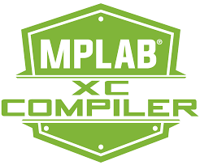

``S-Amiral Compiler``
=====================

Cahier des charges du projet de compilateur

Par Pedro Costa [#cp]_, André Da Silva [#dsa]_, Maël Pedretti [#mp]_

Introduction
------------

Ce projet se déroule dans le cadre du cours de compilateurs à la Haute École Arc de Neuchâtel.

Le but est de réaliser un petit compilateur et de définir les bases d'un langage. Dans ce cas, il s'agira d'améliorer le compilateur et le langage commencés lors des travaux pratiques réalisés en classe.
Des fonctionnalités seront ajoutées au langage et il sera possible d'exécuter le code sur une machine virtuelle à registres et non plus à pile.

Buts
----

Dans cette section sont détaillés les buts du projet.

Ajouts
******

- Ajouter la possibilité d'utiliser des tests sous la forme de clauses ``if``.
- Ajouter la possibilité d'utiliser des boucles sous la forme de clauses ``for``.
- Ajouter la possibilité d'utiliser des fonctions :

  - Premièrement sous la forme de fonctions sans paramètres
  - Deuxièmement sous la forme de fonctions avec nombre de paramètres fixes
  - Éventuellement sous la forme de fonctions avec nombre de paramètres variables
  - Éventuellement implémenter le retour de résultat depuis les fonctions

Modifications
*************
- Modifier le compilateur afin de pouvoir compiler pour une machine à registres
- Typer les variables

Technologies
------------

Dans cette section sont détaillés les technologies utilisées dans le projet

1. Langage : ``Python``
2. Outils : ``Python Lex & Yacc`` (Ply_)
3. Machine virtuelle :

   - Machine à pile : Machine fournie par le professeur.
   - Machine à registres : Parrot_

.. [#cp] Pedro Costa <pedro.costa@he-arc.ch>
.. [#dsa] André Da Silva <andre.netodasilva@he-arc.ch>
.. [#mp] Maël Pedretti <mael.pedretti@he-arc.ch>

.. Bibliographie
.. _Ply: https://pypi.python.org/pypi/ply
.. _Parrot: http://parrot.org/
